# AviUtl2 ColorHalftone

カラーハーフトーン加工をする [AviUtl2](https://spring-fragrance.mints.ne.jp/aviutl/) 用スクリプトです。

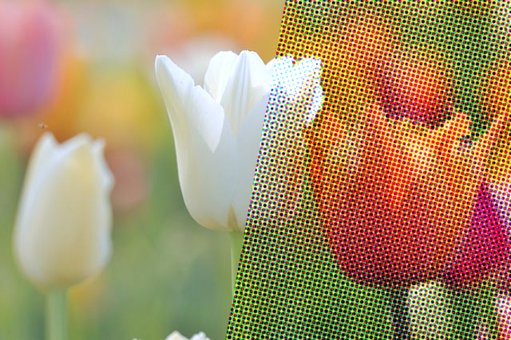
<br>Image by <a href="https://pixabay.com/users/heikiwi-35444888/?utm_source=link-attribution&utm_medium=referral&utm_campaign=image&utm_content=9587986">Heike Tönnemann</a> from <a href="https://pixabay.com//?utm_source=link-attribution&utm_medium=referral&utm_campaign=image&utm_content=9587986">Pixabay</a>

## 動作環境

- [AviUtl ExEdit2](https://spring-fragrance.mints.ne.jp/aviutl/)  
`beta18` 以降必須（`beta34` で動作確認済み）。

## インストール

### AviUtl2 カタログを使う

本プラグインは [aviutl2-catalog](https://github.com/Neosku/aviutl2-catalog) に登録済みです。
メインメニュー ＞ パッケージ一覧 ＞ スクリプト ＞ ColorHalftone からインストールしてください。

### 手動インストール

[Releases](https://github.com/azurite581/AviUtl2-ColorHalftone/releases/latest) から `ColorHalftone_v{version}.au2pkg.zip` をダウンロードし、AviUtl2 のプレビューにドラッグ&ドロップしてください。

>[!caution]
v1.0.0 → v1.1.0 にて、ファイル名を日本語（`カラーハーフトーン`）から英語（`ColorHalftone`）に変更しました。更新時に日本語のものが残ってしまった場合、お手数ですが手動で削除してください。  
同じく v1.1.0、v2.0.0 にて機能変更や新たなパラメーターの追加など、多くの破壊的変更を行っています。それ以前のバージョンとは互換性がありませんので、更新の際は十分ご注意ください。

## 使い方

デフォルトでは `加工` カテゴリの中にあります。  
カラーハーフトーン効果をかけたいオブジェクトに `ColorHalftone` を適用してください。

## パラメーター

### 全体設定

このスクリプトは、ハーフトーン効果を適用した 3 つの色を重ねて表示することで元のオブジェクトの色を再現します。
全体設定はそれら 3 つの色に共通で影響する設定になります（グループ化されていない設定項目です）。

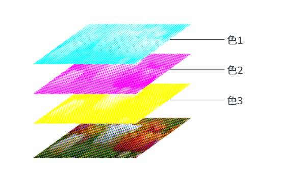

- #### サイズ

  ハーフトーン全体のサイズをパーセンテージで指定します。値を小さくするほどドットが細かくなります。初期値は `50` です。

  | 元画像 | 25 | 50 | 75 |
  | :---: | :---: | :---: | :---: |
  | 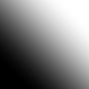 | 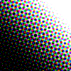 | 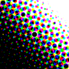 | 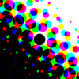 |

- #### ドットサイズ

  ドット 1 つあたりのサイズをパーセンテージで指定します。初期値は `100` です。

  | 元画像 | 50 | 100 | 150 |
  | :---: | :---: | :---: | :---: |
  |  | 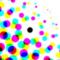 |  | 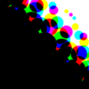 |

- #### X

  ハーフトーンの中心の X 座標。

- #### Y

  ハーフトーンの中心の Y 座標。

- #### 回転

  ハーフトーン全体を回転します。初期値は `0` です。

  | 元画像 | 0 | 30 | 60 |
  | :---: | :---: | :---: | :---: |
  |  | 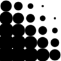 | 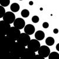 | 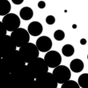 |

  ※比較画像ではわかりやすさのために色を 1 つだけ表示しています。初期状態では 3 つの色のスクリーン角度が `75`, `15`, `60` に設定されており、この回転パラメーターではその角度を保ったままハーフトーン全体を回転させることになります。  
  スクリーン角度を色別に設定したい場合は、[スクリーン角度](#スクリーン角度13)を変更する必要があります。

- #### ドット回転

  ドットを回転します。初期値は `0` です。

  | 元画像 | 0 | 45 |
  | :---: | :---: | :---: |
  |  | 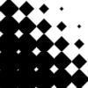 | 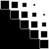 |

  ※ドットの角度を色別に設定したい場合は、[PI](#pi)（パラメーターインジェクション）から設定する必要があります。

- #### 滑らかさ

  全体をぼかすことでハーフトーンを滑らかにします。初期値は `1` です。

- #### 融合度

  ドット同士の融合度。初期値は `0` です。

  | 元画像 | 0 | 25 |
  | :---: | :---: | :---: |
  |  | 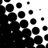 | 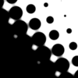 |

- #### 形状

  ドットの形状を指定します。以下の中から選択できます。初期値は `円` です。

  | 元画像 | 円 | 四角形 | 三角形 | 五角形 | 六角形 | 星形 | ハート | 線 |
  | :---: | :---: | :---: | :---: | :---: | :---: | :---: | :---: | :---: |
  |  | 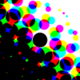 | 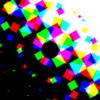 | 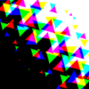 | 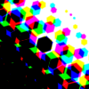 |  | 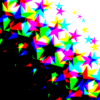 | 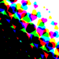 | 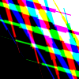 |
  | PIでの値 | `0` | `1` | `2` | `3` | `4` | `5` | `6` | `7` |

- #### 混色方法

  混色方法を指定します。`減法混色`（初期値）か `加法混色` のいずれかを指定できます。

  | 元画像 | `減法混色` | `加法混色` |
  | :---: | :---: | :---: |
  |  | 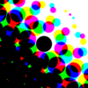 | 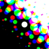 |
  | PIでの値 | `0` | `1` |
  | サンプル画像の色設定 | `背景色`：白（`0x000000`）<br>`色1`：シアン（`0x00ffff`）<br>`色2`：マゼンタ（`0xff00ff`）<br>`色3`：イエロー（`0xffff00`） | `背景色`：黒（`0xffffff`）<br>`色1`：赤（`0xff0000`）<br>`色2`：緑（`0x00ff00`）<br>`色3`：青（`0x0000ff`） |

>[!tip]
加法混色にした際は、背景色は暗めの色に設定することをおすすめします。  
加法混色で元のオブジェクトと同じ色を再現したいときは、`背景色` を黒（`0x000000`）、`色1` を赤（`0xff0000`）、`色2` を緑（`0x00ff00`）、`色3` を青（`0x0000ff`）に設定してください。

- #### 段違い

  ドットの並びを段違いにします。初期値は `OFF` です。

  | 元画像 | 段違い OFF | 段違い ON |
  | :---: | :---: | :---: |
  |  |  | 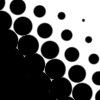 |

### 背景

- #### 背景色

  背景の色を指定します。初期値は白（`0xffffff`）です。

- #### 背景色透明度

  背景色の透明度を指定します。初期値は `0` です。

  | 元画像 | `0` | `100` |
  | :---: | :---: | :---: |
  |  |  |  | 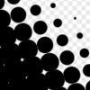 |

- #### 元のアルファを維持

  `ON` の場合、元のオブジェクトのアルファを維持します。`OFF` の場合はアルファを背景色で置き換えます。  
  初期値は `ON` です。

### 表示

- #### 色1~3 表示

  各色の表示状態を設定します。初期状態では全て表示されています。

### 色

- #### 色1~3

  各色を設定します。初期状態では色1 が `0x00ffff`（シアン）、色2 が `0xff00ff`（マゼンタ）、色3 が `0xffff00`（イエロー）になっています。

### スクリーン角度

- #### 色1~3 スクリーン角度

  各色のスクリーン角度を設定します。  
  初期状態では[モアレ](https://ja.wikipedia.org/wiki/%E3%83%A2%E3%82%A2%E3%83%AC)を防ぐために色1 を `75`、色2 を `15`、色3 を `60` に設定しています。

### その他

- #### PI

  パラメーターインジェクション用の入力欄です。以下の形式に沿って値を入力することで、各種パラメーターの値を上書きできます（実際に入力するときは一番外側の波括弧は不要です）。

    ```lua
    {
        size,                            -- 全体のサイズ
        {d_size1, d_size2, d_size3},     -- 各色のドットサイズ
        {{x1, y1}, {x2, y2}, {x3, y3}},  -- 各色の中心座標
        {s_angle1, s_angle2, s_angle3},  -- 各色のスクリーン角度
        {d_angle1, d_angle2, d_angle3},  -- 各色のドット角度
        {v1, v2, v3},                    -- 各色の表示状態
        {col1, col2, col3},              -- 各色
        bg_col,                          -- 背景色
        bg_alpha,                        -- 背景色の透明度
        keep_orig_alpha,                 -- 元のアルファを維持するかどうか
        smoothness,                      -- 滑らかさ
        fusion,                          -- ドットの融合度
        shape,                           -- ドットの形状
        mixing_mode,                     -- 混色方法
        offset,                          -- 段違いにするかどうか
    }
    ```

    |  | 説明 | 型 | 範囲 |
    | :--- | :--- | :--- | :--- |
    | size | 全体のサイズ | number | 0 以上 |
    | {d_size1, d_size2, d_size3} | 各色のドットサイズ | {number, number, number} | 0 以上 |
    | {{x1, y1}, {x2, y2}, {x3, y3}} | 各色の中心座標 | {{number, number}, {number, number}, {number, number}} | |
    | {s_angle1, s_angle2, s_angle3} | 各色のスクリーン角度 | {number, number, number} | |
    | {d_angle1, d_angle2, d_angle3} | 各色のドット角度 | {number, number, number} | |
    | {v1, v2, v3} | 各色の表示状態 | {number, number, number} または {boolean, boolean, boolean} | 0/1 または false/true |
    | {col1, col2, col3} | 各色（16進数カラーコード） | {number, number, number} | |
    | bg_col | 背景色（16進数カラーコード） | number | |
    | bg_alpha | 背景色の透明度 | number | [0, 100] |
    | keep_orig_alpha | 元のアルファを維持するかどうか | number または boolean | 0/1 または false/true |
    | smoothness | 滑らかさ | number | [0, 5] |
    | fusion | ドットの融合度 | number | 0 以上 |
    | shape | ドットの形状 | number | [0, 7] |
    | mixing_mode | 混色方法 | number | [0, 1] |
    | offset | 段違いにするかどうか | number または boolean | 0/1 または false/true |

## ライセンス

[MIT License](LICENSE.txt) に基づくものとします。

## クレジット

### 使用したツール

### [aulua](https://github.com/karoterra/aviutl2-aulua)

<details>
<summary>MIT License</summary>

```text
MIT License

Copyright (c) 2025 karoterra

Permission is hereby granted, free of charge, to any person obtaining a copy
of this software and associated documentation files (the "Software"), to deal
in the Software without restriction, including without limitation the rights
to use, copy, modify, merge, publish, distribute, sublicense, and/or sell
copies of the Software, and to permit persons to whom the Software is
furnished to do so, subject to the following conditions:

The above copyright notice and this permission notice shall be included in all
copies or substantial portions of the Software.

THE SOFTWARE IS PROVIDED "AS IS", WITHOUT WARRANTY OF ANY KIND, EXPRESS OR
IMPLIED, INCLUDING BUT NOT LIMITED TO THE WARRANTIES OF MERCHANTABILITY,
FITNESS FOR A PARTICULAR PURPOSE AND NONINFRINGEMENT. IN NO EVENT SHALL THE
AUTHORS OR COPYRIGHT HOLDERS BE LIABLE FOR ANY CLAIM, DAMAGES OR OTHER
LIABILITY, WHETHER IN AN ACTION OF CONTRACT, TORT OR OTHERWISE, ARISING FROM,
OUT OF OR IN CONNECTION WITH THE SOFTWARE OR THE USE OR OTHER DEALINGS IN THE
SOFTWARE.
```

</details>

### [aviutl2-cli](https://github.com/sevenc-nanashi/aviutl2-cli)

<details>
<summary>MIT License</summary>

```text
MIT License

Copyright (c) 2026 Nanashi. <sevenc7c.com>

Permission is hereby granted, free of charge, to any person obtaining a copy
of this software and associated documentation files (the "Software"), to deal
in the Software without restriction, including without limitation the rights
to use, copy, modify, merge, publish, distribute, sublicense, and/or sell
copies of the Software, and to permit persons to whom the Software is
furnished to do so, subject to the following conditions:

The above copyright notice and this permission notice shall be included in all
copies or substantial portions of the Software.

THE SOFTWARE IS PROVIDED "AS IS", WITHOUT WARRANTY OF ANY KIND, EXPRESS OR
IMPLIED, INCLUDING BUT NOT LIMITED TO THE WARRANTIES OF MERCHANTABILITY,
FITNESS FOR A PARTICULAR PURPOSE AND NONINFRINGEMENT. IN NO EVENT SHALL THE
AUTHORS OR COPYRIGHT HOLDERS BE LIABLE FOR ANY CLAIM, DAMAGES OR OTHER
LIABILITY, WHETHER IN AN ACTION OF CONTRACT, TORT OR OTHERWISE, ARISING FROM,
OUT OF OR IN CONNECTION WITH THE SOFTWARE OR THE USE OR OTHER DEALINGS IN THE
SOFTWARE.
```

</details>

## 更新履歴

[CHANGELOG](CHANGELOG.md) を参照してください。
